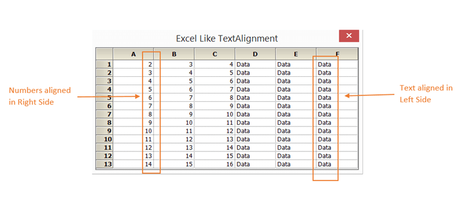

# How to achieve Excel like text alignment in WinForms GridControl?

By default, text alignment in [WinForms GridControl](https://www.syncfusion.com/winforms-ui-controls/grid-control) is right-aligned for both alphabetic and numeric values. To achieve Excel-like alignment, use the [ExcelLikeAlignment](https://help.syncfusion.com/cr/windowsforms/Syncfusion.Windows.Forms.Grid.GridControlBase.html#Syncfusion_Windows_Forms_Grid_GridControlBase_ExcelLikeAlignment) property. With this setting, string values are aligned to the left and numeric values are aligned to the right within each cell, matching Excel’s default behavior.

**C#**

```csharp
this.gridControl1.ExcelLikeAlignment = true;
```

**VB**

```vb
Me.GridControl1.ExcelLikeAlignment = True
```

